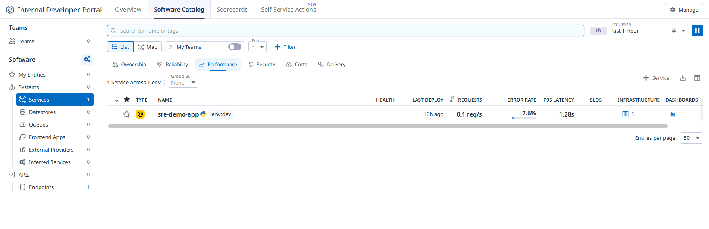
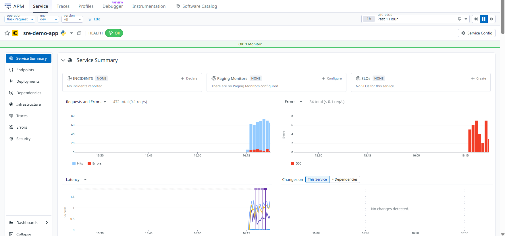
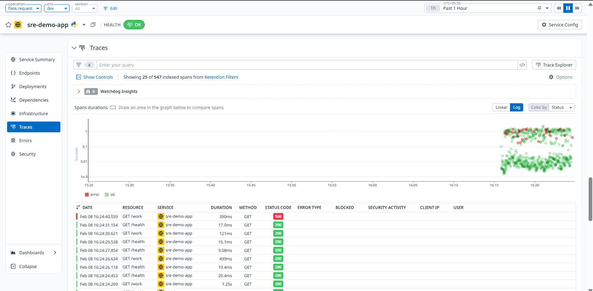
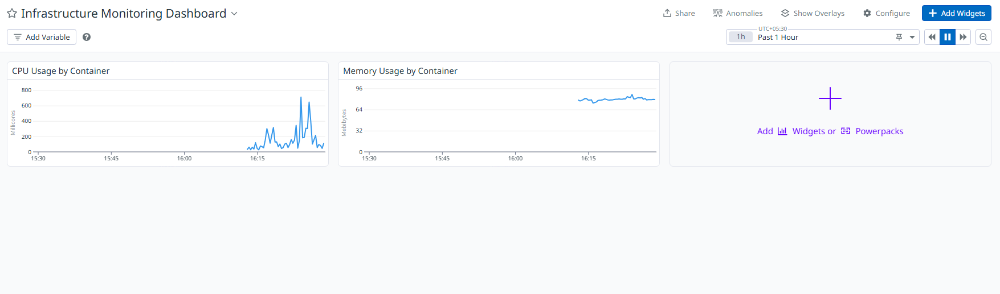
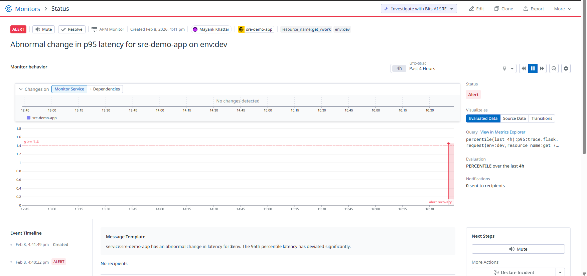
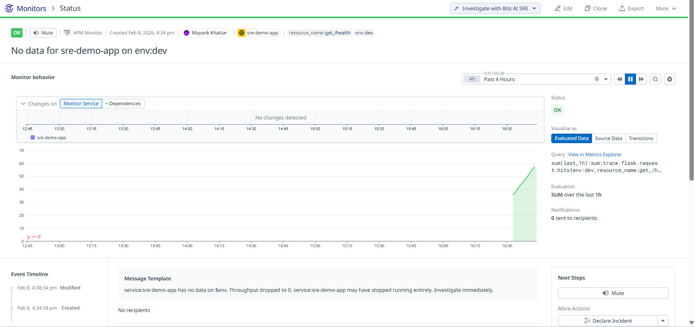
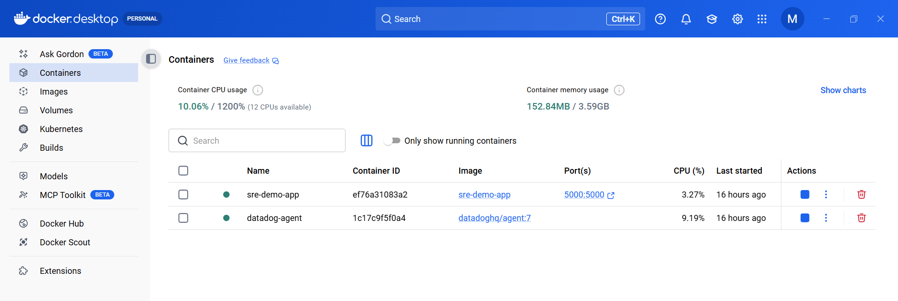
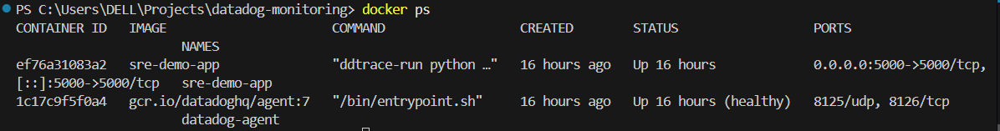

# Datadog Service Monitoring & Alerting

## Project Summary

This project is a hands-on **Site Reliability Engineering (SRE) observability demo** built to showcase how a containerized service can be monitored, traced, and alerted using Datadog.

The focus is not on building application features, but on **operational visibility**:
how an SRE understands service health, detects failures early, and reacts using metrics, traces, and alerts.

The service intentionally introduces latency and errors so real signals can be observed in dashboards, traces, and monitors.

---

## Why This Project

Modern production systems fail in subtle ways long before they fully go down.

This project is designed around a simple philosophy:

> _If something goes wrong, can I detect it quickly, understand why, and act with confidence?_

Rather than simulating large infrastructure, this demo keeps the system small and realistic, while still exposing the same signals used in real production environments.

---

## Stack Used

- **Python (Flask)** – Sample HTTP service
- **Docker** – Containerized runtime
- **Datadog**
  - APM (Tracing)
  - Infrastructure Monitoring
  - Dashboards
  - Alerts & Monitors

---

## Components Built

### 1. Instrumented Application Service

A Flask service exposing:

- `/health` – health check endpoint
- `/work` – endpoint with simulated latency and intermittent 500 errors

The service is instrumented with Datadog APM to emit:

- request traces
- latency metrics
- error signals

---

### 2. Datadog Service & APM Visibility

The service appears in Datadog with full APM visibility, including:

- request throughput
- error rate
- p95 latency
- deployment and change tracking





---

### 3. Distributed Tracing

Each request generates traces that allow:

- drilling into slow requests
- identifying failed requests
- visualizing request execution timing



---

### 4. Infrastructure & Container Metrics

Container-level metrics are collected automatically:

- CPU usage
- memory usage
- container health

These metrics are visualized in a dedicated dashboard.



---

### 5. Alerting & Failure Detection

Two production-style monitors are configured:

#### a) High Latency Alert (p95)

Triggers when p95 latency exceeds the defined threshold.



#### b) Service Availability Alert

Triggers when request throughput drops to zero, indicating the service may be unavailable.



---

### 6. Runtime Proof (Local Environment)

The service and Datadog Agent run locally via Docker, demonstrating a realistic setup without managed infrastructure.





---

## Targets Achieved

- End-to-end observability using Datadog APM
- Real latency and error signals, not synthetic metrics
- Actionable alerts tied to service behavior
- Clear separation of application logic and operational visibility
- Demonstrated SRE workflow: **detect → investigate → alert**

---

## How to Run Locally

High-level steps:

1. Build and run the Flask service container
2. Run the Datadog Agent container with APM enabled
3. Generate traffic to `/health` and `/work`
4. Observe metrics, traces, and alerts in Datadog

To generate simulated traffic, the following commands can be used:

```bash
while true; do curl http://localhost:5000/work; sleep 1; done
while true; do curl http://localhost:5000/health; sleep 1; done


---

## Notes

This is a personal demo project created independently to explore observability and alerting concepts.
All components are self-contained and use simulated behavior.

---
```
